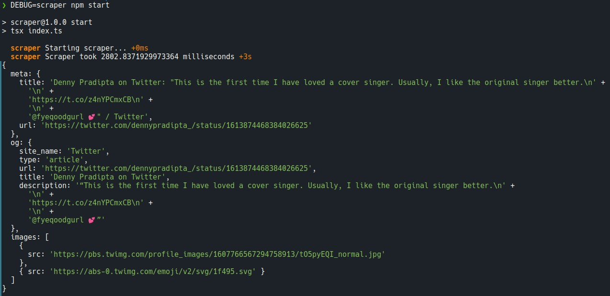

# Twitter Scraper

A simple Twitter scraper made using Puppeteer and Fast HTML Parser. This will get the page title, description, and images in the designated tweet.

## How to Use

1. Run `npm ci`
2. Copy existing .env.example to .env
3. Fill out the tweet URL
4. Run `npm start`. Alternatively, run `DEBUG=scraper npm start` to see the performance.

## Screenshot



## Running in Docker

1. Build the image

   ```bash
   docker build . -t scraper
   ```

   Or, if you use M1:

   ```bash
   docker buildx build --platform linux/amd64 -t scraper .
   ```

2. Run the Docker image

   ```bash
   docker run -it --rm \
     --volume ${pwd}output:/output \
     -e TWITTER_URL=<YOUR_TWITTER_URL> \
     spanduck
   ```

3. Check your output image in the output folder, located in your working directory.
